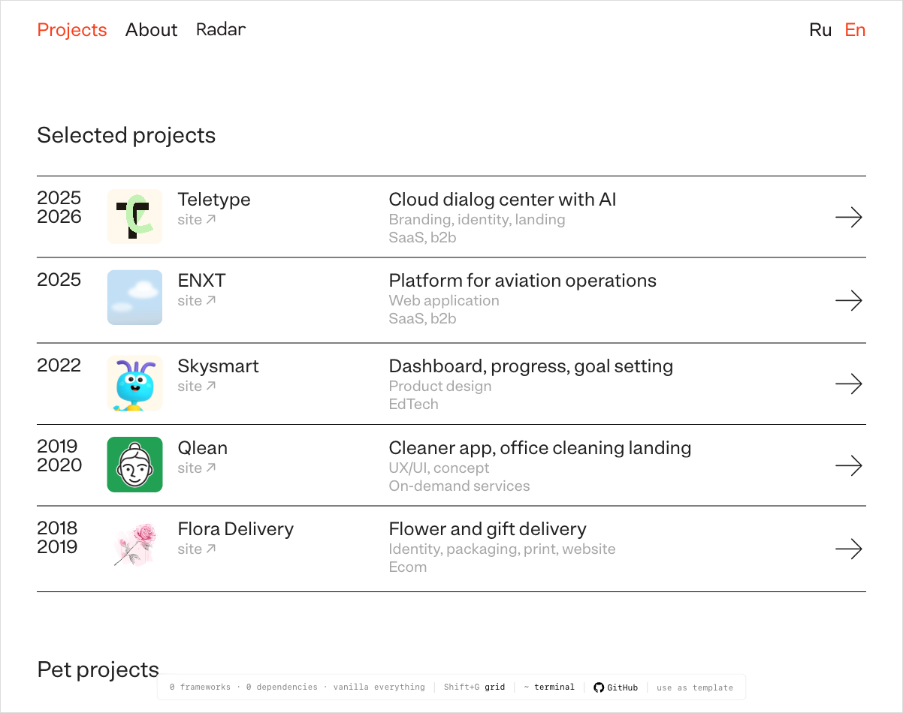
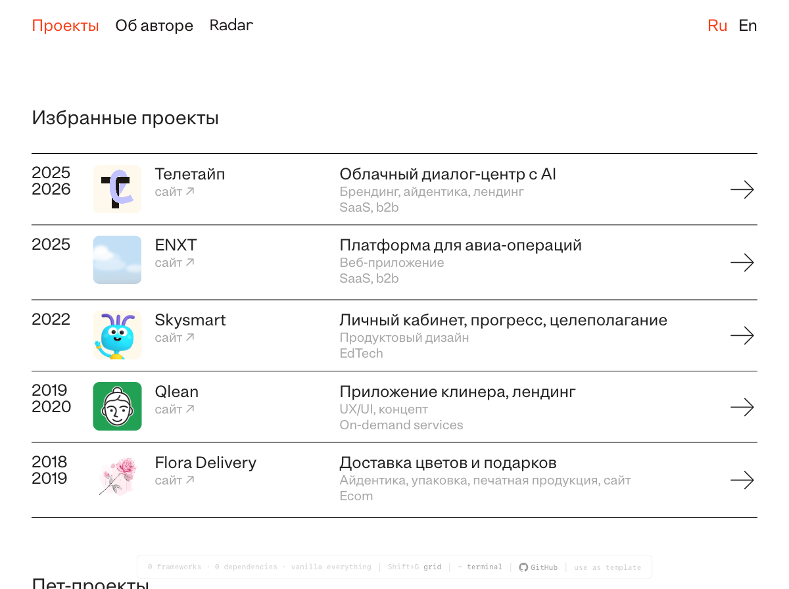

# Portfolio Template

[](https://opensource.org/licenses/MIT)
[](https://github.com/diyoriko/portfolio-template/stargazers)
[](https://github.com/diyoriko/portfolio-template)
[](https://github.com/diyoriko/portfolio-template/generate)

A clean, minimal, bilingual (RU/EN) portfolio template for designers. Based on [diyor.design](https://diyor.design).



**[Live Demo →](https://portfolio-template-demo-463.netlify.app)** · **[Use this template →](https://github.com/diyoriko/portfolio-template/generate)**

## Features

- **Zero dependencies** — vanilla HTML, CSS, JavaScript
- **Bilingual** — Russian and English with language switcher
- **Responsive** — mobile-first, works on all screen sizes
- **Case study template** — 20 components: sections, stats, tabs, carousels, mac mockups, font showcases, image grids
- **Scroll reveal** — subtle entrance animations
- **Lightbox** — click-to-zoom on case study images
- **Terminal easter egg** — press `~` for a secret terminal
- **Design system overlay** — press `Shift+G` to see the 12-column grid
- **GoatCounter analytics** — privacy-friendly, cookie-free
- **SEO ready** — meta tags, Open Graph, structured data, sitemap
- **Print stylesheet** — clean printable version of the about page
- **Dark mode** — toggle button + automatic system preference, persisted in localStorage
- **Accessible** — ARIA attributes, keyboard focus styles, reduced motion support
- **GitHub Pages ready** — just push to main

## Quick Start

### 1. Get the template

Click **[Use this template](https://github.com/diyoriko/portfolio-template/generate)** on GitHub, or:

```bash
git clone https://github.com/YOUR_USERNAME/portfolio-template.git my-portfolio
cd my-portfolio
```

### 2. Run setup

```bash
chmod +x setup.sh
./setup.sh
```

The script will ask for your name, domain, email, socials, and location. It then:
- Replaces all placeholder values across every file
- Generates a favicon with your initial
- Updates CNAME, sitemap, config.json

### 3. Add your content

- Replace case studies in `projects/` and `en/projects/`
- Replace images in `assets/img/`
- Update bio in `about.html` and `en/about.html`

### 4. Deploy

```bash
git add .
git commit -m "my portfolio"
git push origin main
```

Go to **Settings → Pages** → set source to `main`.

## One-Click Deploy

[](https://app.netlify.com/start/deploy?repository=https://github.com/diyoriko/portfolio-template)

[](https://vercel.com/new/clone?repository-url=https://github.com/diyoriko/portfolio-template)

Or use GitHub Pages (free): push to `main` branch, enable Pages in Settings.

## Structure

```
.
├── index.html              # Home page (RU)
├── about.html              # About page (RU)
├── 404.html                # 404 error page
├── projects/
│   └── example.html        # Case study (RU)
├── en/
│   ├── index.html          # Home page (EN)
│   ├── about.html          # About page (EN)
│   └── projects/
│       └── example.html    # Case study (EN)
├── assets/
│   └── img/                # Project thumbnails (WebP + PNG fallback)
├── .github/
│   └── ISSUE_TEMPLATE/     # Bug report & feature request templates
├── styles.css              # Full CSS source
├── styles.min.css          # Minified CSS
├── script.js               # Full JS source
├── script.min.js           # Minified JS
├── config.json             # Template configuration
├── setup.sh                # Interactive setup script
├── manifest.json           # PWA manifest
├── sitemap.xml             # Sitemap
├── robots.txt              # Robots
├── CNAME                   # Custom domain
├── favicon.svg             # Favicon
├── CONTRIBUTING.md         # Contributor guide
└── README.md
```

## Customization

### Colors

Edit CSS variables in `styles.css`:

```css
:root {
  --bg: #ffffff;          /* Background */
  --text: #222222;        /* Text color */
  --text-dim: #999999;    /* Secondary text */
  --accent: #F8401C;      /* Accent color (links, hover, buttons) */
  --line: #000000;        /* Borders and dividers */
  --selection-bg: #F8401C; /* Text selection highlight */
}
```

Also update the accent color in:
- `favicon.svg` — the circle fill color
- `config.json` — the `accent_color` field

### Dark Mode

Dark mode works in two ways:
- **Automatic** — follows the user's system preference (`prefers-color-scheme: dark`)
- **Manual toggle** — click the ☽/☀ button in the navigation bar

The user's choice is saved in `localStorage` and persists across sessions.

To customize dark mode colors, edit the `@media (prefers-color-scheme: dark)` and `html.dark` blocks in `styles.css`.

To disable dark mode entirely, remove those CSS blocks and the `initThemeToggle()` function from `script.js`.

### Fonts

The template uses [Inter](https://fonts.google.com/specimen/Inter) + [DM Mono](https://fonts.google.com/specimen/DM+Mono) from Google Fonts. To change:

1. Pick fonts at [fonts.google.com](https://fonts.google.com)
2. Replace the `<link href="https://fonts.googleapis.com/...">` in all HTML files
3. Update `--font-sans` and `--font-mono` in `styles.css`

Or use local font files:

1. Add `.woff2` files to `assets/fonts/`
2. Add `@font-face` declarations to `styles.css`
3. Remove the Google Fonts `<link>` from HTML files

### Project Sections

The home page has three sections:

- **Selected projects** — main work with thumbnails
- **Pet projects** — side projects, experiments
- **Archive** — older work

To remove a section, delete its `<h2>` and `<div class="project-list">` block.

### Adding Projects

1. Duplicate `projects/example.html` (and `en/projects/example.html`)
2. Update content, images, and meta tags
3. Add a project card to `index.html` (and `en/index.html`)
4. Add the URL to `sitemap.xml`

### Case Study Components

Case studies use a consistent structure:

```html
<section class="case-section">
  <span class="case-section-num">1</span>
  <h2 class="case-section-title">SECTION TITLE</h2>
  <p>Section content...</p>
</section>
```

Available components:

| Component | Usage |
|---|---|
| `.case-section` | Numbered content section with title |
| `.case-stats` | Key metrics grid (4 columns) |
| `.case-img-full` | Full-width image (click to lightbox) |
| `.case-img-row` | Two images side by side |
| `.case-img-row--3` | Three-column image grid |
| `.case-concept` | Figure with image + caption (use inside `.case-img-row--3`) |
| `.case-img-bordered` | Image with visible 1px border |
| `.case-img-scroll` | Scrollable container for tall images (500px max) |
| `.case-caption` | Caption text below image |
| `.case-quote` | Blockquote with citation |
| `.case-description` | Large intro text with indent |
| `.case-links` | External links (Figma, prototype, site) |
| `.case-video` | Autoplay video wrapper |
| `.case-separator` | Horizontal divider |
| `.case-nav` | Previous/next project links |
| `.case-tabs` | Tabbed content (e.g. Identity / Landing) |
| `.case-slideshow-wrap` | Image carousel with arrows and counter |
| `.case-font-showcase` | Typography specimen (name, weights, characters) |
| `.mac-mockup` | Browser window mockup with titlebar |

Example slideshow:

```html
<div class="case-slideshow-wrap" data-slideshow>
  <div class="case-slideshow">
    <div class="case-slideshow-track">
      
      
    </div>
    <div class="case-slideshow-nav">
      <span class="case-slideshow-counter" data-counter>1/2</span>
    </div>
  </div>
  <button class="case-slideshow-arrow" data-prev>&#x2039;</button>
  <button class="case-slideshow-arrow" data-next>&#x203A;</button>
</div>
```

Example tabs:

```html
<div class="case-tabs" role="tablist">
  <button class="case-tab active" data-tab="design" role="tab" aria-selected="true">Design</button>
  <button class="case-tab" data-tab="dev" role="tab" aria-selected="false">Development</button>
</div>
<div class="case-tab-panel active" data-panel="design" role="tabpanel">
  <!-- Design content -->
</div>
<div class="case-tab-panel" data-panel="dev" role="tabpanel">
  <!-- Dev content -->
</div>
```

Example mac mockup:

```html
<div class="mac-mockup">
  <div class="mac-mockup-titlebar">
    <div class="mac-mockup-dots">
      <span class="mac-mockup-dot mac-mockup-dot--close"></span>
      <span class="mac-mockup-dot mac-mockup-dot--minimize"></span>
      <span class="mac-mockup-dot mac-mockup-dot--maximize"></span>
    </div>
    <span class="mac-mockup-url">example.com</span>
  </div>
  <div class="mac-mockup-viewport">
    
  </div>
</div>
```

### Spacing

Key spacing variables in `styles.css`:

```css
--content-max: 1156px;    /* Max content width */
--content-pad: 48px;      /* Side padding (24px on mobile) */
--radius-sm: 10px;        /* Border radius */
```

### Analytics

Replace `YOURSITE` in the GoatCounter script tag, or run `setup.sh` which handles this automatically.

Sign up at [goatcounter.com](https://www.goatcounter.com/) (free, no cookies, GDPR-friendly).

To use a different analytics provider, replace the GoatCounter `<script>` tag in all HTML files.

### Custom Domain

1. Update `CNAME` with your domain
2. In GitHub repo: **Settings > Pages > Custom domain**
3. Set up DNS: CNAME record pointing to `YOUR_USERNAME.github.io`

### Removing Bilingual Support

If you only need one language:

1. Delete the `en/` folder (or root RU files)
2. Remove the language switcher from `<nav>` in all pages
3. Remove `hreflang` `<link>` tags from `<head>`

### Favicon

Replace `favicon.svg` with your own. The default is an accent-colored circle with "P". For best compatibility, also add a `favicon.ico` (32x32 PNG).

### OG Images

Replace `assets/img/og-image.png` (1200x630) for social media previews. Each project page can have its own OG image — update the `og:image` meta tag.

### Rebuilding Minified Files

After editing `styles.css` or `script.js`:

```bash
npx csso styles.css -o styles.min.css
npx terser script.js -o script.min.js --compress --mangle
```

HTML files load `.min.css` and `.min.js` — always rebuild after changes.

## Grid System

- 12-column grid, 1156px max width, 20px column gap
- Side padding: 48px (desktop), 24px (tablet/mobile)
- Text column: 764px centered
- Breakpoints: 1000px (tablet), 600px (compact), 480px (mobile)
- Press `Shift+G` in the browser to visualize the grid

## Contact Form

This template doesn't include a contact form by default. To add one:

**Option A: [Formspree](https://formspree.io)** (free tier: 50 submissions/month)

```html
<form action="https://formspree.io/f/YOUR_ID" method="POST">
  <input type="email" name="email" placeholder="Your email" required>
  <textarea name="message" placeholder="Message" required></textarea>
  <button type="submit">Send</button>
</form>
```

**Option B: [Netlify Forms](https://docs.netlify.com/forms/setup/)** (free with Netlify hosting)

```html
<form name="contact" method="POST" data-netlify="true">
  <input type="email" name="email" required>
  <textarea name="message" required></textarea>
  <button type="submit">Send</button>
</form>
```

## Adding More Languages

The template ships with Russian and English. To add a third language:

1. Create a new folder (e.g., `tr/` for Turkish)
2. Copy `en/index.html`, `en/about.html`, and `en/projects/` into it
3. Translate the content
4. Add `hreflang` links to all pages:
   ```html
   <link rel="alternate" hreflang="tr" href="https://example.com/tr/">
   ```
5. Add a language option to the `<nav>` switcher in all pages
6. Add the new URLs to `sitemap.xml`

## Browser Support

All modern browsers (Chrome, Firefox, Safari, Edge). No IE11 support.

## Performance

Built for speed: no JavaScript frameworks, no CSS preprocessors, minimal assets.

Lighthouse scores (localhost, headless Chrome):

- Performance: 90
- Accessibility: 92
- Best Practices: 81
- SEO: 100

## License

MIT — use freely for personal and commercial projects.

---

Built by [Diyor Khakimov](https://diyor.design).
